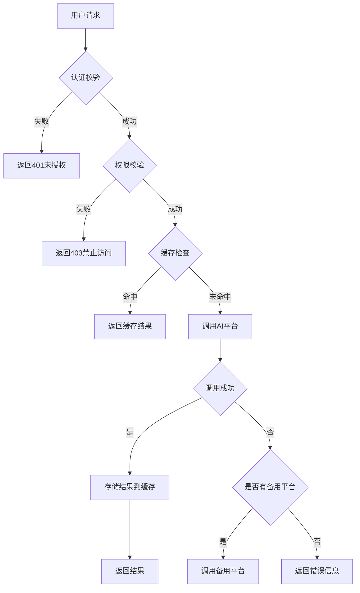

# 通用AI后台平台需求文档

## 1. 项目概述

### 1.1 项目背景
搭建一套通用的AI基础平台，当前业务涉及多个AI平台（如OpenAI、文心一言、自研模型）的集成调用，去解决不同app开发不同后端的问题。为提升AI能力复用效率，降低集成成本，需构建一套通用AI后台平台，实现多AI平台的统一管理与调用。

### 1.2 项目目标
- 提供统一API接口，屏蔽不同AI平台的技术差异
- 支持动态扩展新的AI平台，无需修改核心代码
- 实现请求缓存、负载均衡、熔断降级等服务治理能力
- 建立完善的安全机制（包括鉴权、数据加密、流量监控）
- 提供可视化管理界面，支持模型配置、权限管理、监控告警


## 2. 系统架构设计

### 2.1 整体架构
系统采用四层架构设计：
```
┌─────────────────────────────────────────┐
│             前端应用层                  │
│ （Web/APP/第三方系统，通过API对接后端）  │
└────────┬───────────────────────────────┘
         ▼
┌─────────────────────────────────────────┐
│             API网关层（Gateway）         │
│  功能：请求路由、认证鉴权、流量控制、日志  │
└────────┬───────────────────────────────┘
         ▼
┌─────────────────────────────────────────┐
│             核心服务层（Core Services）  │
│  ├─ 接口适配层：统一封装不同AI平台接口    │
│  ├─ 服务调度层：任务分配、优先级管理      │
│  ├─ 数据处理层：特征提取、结果聚合        │
│  └─ 缓存层：热点数据缓存，提升响应速度    │
└────────┬───────────────────────────────┘
         ▼
┌─────────────────────────────────────────┐
│             数据存储层（Data Layer）     │
│  ├─ 原始数据：AI平台返回结果持久化        │
│  ├─ 元数据：模型配置、用户偏好、任务记录  │
│  └─ 日志数据：操作日志、错误日志、性能监控│
└────────┬───────────────────────────────┘
         ▼
┌─────────────────────────────────────────┐
│             AI平台接口层（Providers）    │
│  对接OpenAI、百度文心一言、科大讯飞等平台 │
└─────────────────────────────────────────┘
```

### 2.2 技术栈选型
| 层次         | 技术组件                  | 说明                                |
|--------------|---------------------------|-------------------------------------|
| 后端框架     | FastAPI + Python          | 高性能API开发                       |
| API网关      | Kong                      | 支持动态路由、插件扩展              |
| 服务发现     | Consul                    | 服务注册与发现                      |
| 认证中心     | Keycloak                  | 统一身份认证与授权                  |
| 缓存         | Redis                     | 热点数据缓存                        |
| 消息队列     | RabbitMQ                  | 异步任务处理                        |
| 数据存储     | PostgreSQL + MongoDB      | 关系型数据与非关系型数据存储        |
| 监控告警     | Prometheus + Grafana      | 系统性能监控与可视化                |
| 日志管理     | ELK Stack                 | 日志收集、存储与分析                |
| 容器化       | Docker + Kubernetes       | 服务容器化部署与编排                |


## 3. 功能需求

### 3.1 接口适配层
- **统一API接口**
  - 提供标准化的请求参数格式（如支持JSON、FormData）
  - 统一响应格式（包含状态码、错误信息、返回数据）
  - 支持同步/异步调用模式
- **AI平台适配器**
  - 支持动态加载新的AI平台适配器
  - 每个适配器需实现统一接口规范（初始化、调用、健康检查）
  - 自动处理平台特有的参数转换与结果格式适配

### 3.2 服务调度层
- **负载均衡**
  - 基于响应时间、成功率、并发量的智能负载均衡
  - 支持按用户/业务线指定优先调用的AI平台
- **熔断降级**
  - 当某平台错误率超过阈值（如50%）时自动熔断
  - 熔断后自动切换到备用平台或返回降级结果
- **限流控制**
  - 支持按用户、模型、接口维度设置限流策略
  - 提供多种限流算法（令牌桶、漏桶）
  - 限流触发时返回标准错误信息（HTTP 429）

### 3.3 数据处理层
- **请求预处理**
  - 输入数据格式校验与转换
  - 敏感信息过滤与合规处理
- **结果后处理**
  - 多模型结果融合（如取多个模型的平均置信度）
  - 内容安全审核（如敏感词检测、违规内容识别）
- **数据缓存**
  - 基于请求参数自动生成缓存键
  - 支持不同TTL策略（按模型、按业务场景）
  - 缓存穿透、击穿、雪崩防护机制

### 3.4 数据存储层
- **模型管理**
  - 记录可用模型信息（名称、提供商、版本、调用地址）
  - 模型性能指标（平均响应时间、成功率）
- **调用记录**
  - 记录所有API调用日志（请求时间、参数、响应结果）
  - 支持按用户、模型、时间段查询
- **系统配置**
  - 存储全局配置参数（如缓存TTL、限流阈值）
  - 支持配置动态刷新

### 3.5 安全与权限
- **认证授权**
  - 支持OAuth 2.0、JWT、API Key等认证方式
  - 基于RBAC的权限控制（角色、用户、权限三级管理）
- **数据安全**
  - 敏感数据加密存储（如用户API Key）
  - 传输层加密（HTTPS）
- **审计日志**
  - 记录所有权限变更操作
  - 记录异常访问尝试

### 3.6 监控与运维
- **性能监控**
  - 实时监控系统QPS、响应时间、错误率
  - 各AI平台调用成功率、平均响应时间
- **告警系统**
  - 支持自定义告警规则（如响应时间超过阈值、错误率飙升）
  - 多渠道告警（邮件、短信、企业微信）
- **可视化界面**
  - 系统概览仪表盘
  - 详细的模型调用统计报表


## 4. 非功能需求

### 4.1 性能要求
- 平均响应时间：≤500ms（缓存命中），≤2000ms（缓存未命中）
- 并发处理能力：单节点支持≥1000TPS
- 服务可用性：≥99.9%

### 4.2 安全要求
- 符合等级保护三级要求
- 敏感数据加密存储（AES-256）
- 定期安全漏洞扫描与修复

### 4.3 扩展性要求
- 支持水平扩展（通过增加节点提升处理能力）
- 支持垂直扩展（升级单个节点硬件配置）
- 支持新AI平台快速接入（适配器开发周期≤1周）

### 4.4 可维护性要求
- 代码符合PEP8规范（Python）
- 关键模块覆盖率≥80%
- 完善的文档（API文档、开发文档、运维文档）


## 5. API接口规范

### 5.1 通用请求格式
```json
{
  "model": "gpt-4",
  "parameters": {
    "prompt": "你好，世界",
    "temperature": 0.7,
    "max_tokens": 100,
    "prompt_id" : "scene_1"
  },
  "user_info": {
    "user_id": "123456",
    "user_role": "admin"
  },
  "request_id": "uuid-1234567890"
}
```

### 5.2 通用响应格式
```json
{
  "code": 200,
  "message": "success",
  "data": {
    "result": "你好！有什么可以帮助你的吗？",
    "model_info": {
      "name": "gpt-4",
      "provider": "openai",
      "version": "0613"
    },
    "usage": {
      "prompt_tokens": 5,
      "completion_tokens": 10,
      "total_tokens": 15
    }
  },
  "request_id": "uuid-1234567890",
  "timestamp": 1689567890
}
```

### 5.3 核心API列表
| 接口名称       | 方法 | 路径               | 描述                     |
|----------------|------|--------------------|--------------------------|
| 模型调用       | POST | /api/v1/chat/completions | 通用聊天接口           |
| 模型列表       | GET  | /api/v1/models     | 获取可用模型列表       |
| 调用记录查询   | GET  | /api/v1/history    | 查询历史调用记录       |
| 系统配置       | GET/POST | /api/v1/config    | 获取/更新系统配置      |
| 健康检查       | GET  | /health            | 系统健康状态检查       |


## 6. 数据模型

### 6.1 模型配置表（models）
| 字段名         | 类型       | 描述                     |
|----------------|------------|--------------------------|
| id             | String     | 模型唯一标识             |
| name           | String     | 模型名称                 |
| provider       | String     | 模型提供商（openai、baidu等） |
| endpoint       | String     | API调用地址              |
| api_key        | String     | 加密后的API密钥          |
| status         | String     | 状态（active、disabled） |
| max_concurrency| Integer    | 最大并发数               |
| price_per_token| Float      | 每token价格（元）        |

### 6.2 调用记录表（invocations）
| 字段名         | 类型       | 描述                     |
|----------------|------------|--------------------------|
| id             | String     | 调用唯一标识             |
| user_id        | String     | 用户ID                   |
| model_id       | String     | 模型ID                   |
| request_params | JSON       | 请求参数                 |
| response_data  | JSON       | 响应数据                 |
| status         | String     | 状态（success、failed）  |
| error_message  | String     | 错误信息                 |
| start_time     | Timestamp  | 开始时间                 |
| end_time       | Timestamp  | 结束时间                 |
| tokens_used    | Integer    | 使用的token数量          |


## 7. 开发与部署规范

### 7.1 开发规范
- 采用敏捷开发模式，2周/迭代
- 使用Git进行版本控制，主干开发流程
- 代码提交前需通过静态代码检查（flake8）
- 关键功能需编写单元测试（pytest）

### 7.2 部署架构
- 采用Kubernetes进行容器编排
- 部署3个可用区，实现高可用架构
- 前后端分离部署，前端使用Nginx作为静态资源服务器

### 7.3 环境配置
| 环境   | 服务器配置               | 访问权限               |
|--------|--------------------------|------------------------|
| 开发   | 4核8G x 2                | 开发团队内部访问       |
| 测试   | 8核16G x 3               | 测试团队+开发团队      |
| 预发   | 16核32G x 3              | 运维团队+产品团队      |
| 生产   | 32核64G x 5（每个可用区） | 仅限授权运维人员访问   |


## 8. 验收标准

### 8.1 功能验收
- 所有API接口通过功能测试
- 缓存命中率达到80%以上
- 熔断、限流、负载均衡功能正常
- 权限控制精确生效

### 8.2 性能验收
- 在500并发下，响应时间P95≤2000ms
- 系统连续运行72小时无故障
- 资源利用率（CPU、内存）稳定在70%以下

### 8.3 安全验收
- 通过专业渗透测试，无高危漏洞
- 数据加密符合行业标准
- 审计日志完整记录关键操作


## 9. 附录

### 9.1 术语表
| 术语         | 解释                             |
|--------------|----------------------------------|
| LRU          | 最近最少使用（缓存淘汰算法）     |
| RBAC         | 基于角色的访问控制               |
| JWT          | JSON Web Token（认证令牌）       |
| Mutual TLS   | 双向TLS认证                      |

### 9.2 参考文档
- OpenAI API文档：https://platform.openai.com/docs/api-reference
- Keycloak官方文档：https://www.keycloak.org/documentation
- Kong API网关文档：https://docs.konghq.com/

### 9.3 流程图


# TODO
- [ ] 实现角色权限管理
- [ ] 实现线上模型动态选择，降低API成本
- [ ] 实现调用记录查询
- [ ] 实现系统配置接口
- [ ] 实现健康检查接口
- [ ] 实现模型并发控制
- [ ] 实现模型调用超时处理
- [ ] 实现模型调用失败重试
- [ ] 实现模型调用失败熔断
- [ ] 实现模型调用负载均衡
- [ ] 实现模型调用缓存
- [ ] 实现模型调用日志记录